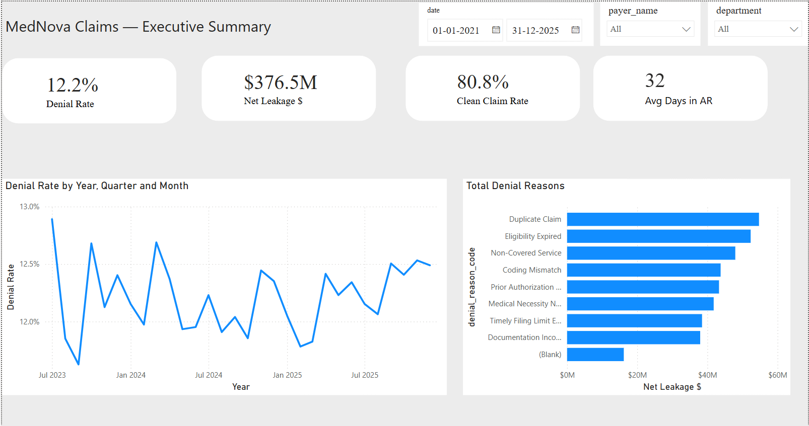
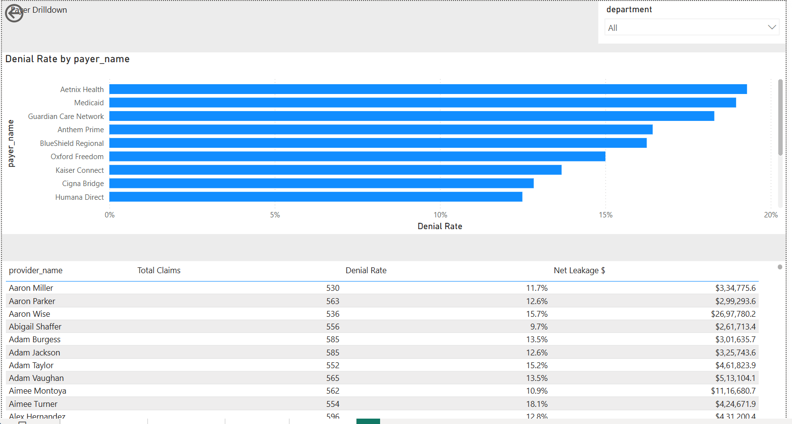
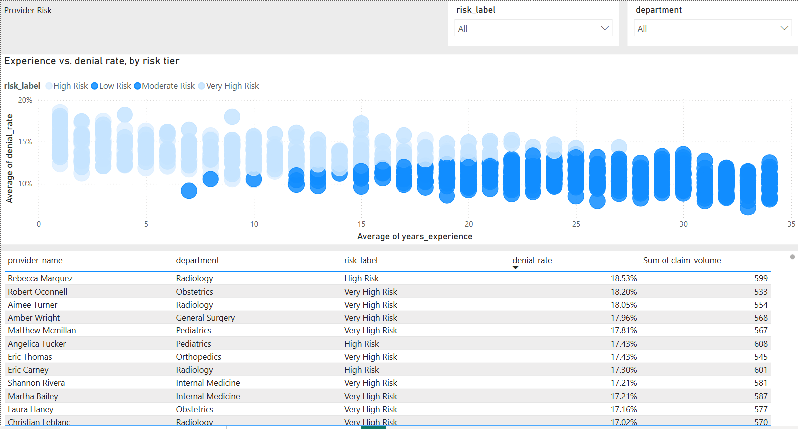

# Healthcare Claims Denial & Revenue Leakage Analytics

**SQL | Python | Power BI | DAX | Data Quality | Business Intelligence**

> End-to-end portfolio analytics project demonstrating how claim-level healthcare data can be transformed into executive KPIs, payer/provider analysis, denial-driver investigation, and actionable business recommendations.

**Portfolio note:** This project uses synthetic, business-realistic data. It is not a real client implementation and contains no real patient or confidential healthcare information.

## Business Problem

Healthcare claims denials can delay reimbursement, increase accounts receivable, and create preventable revenue leakage. The analysis answers:

- Which payers have the highest denial rates?
- Which denial reasons contribute most to financial leakage?
- Which providers/departments show elevated performance risk?
- Where should coding, documentation, authorization, or process improvements be prioritized?
- Can executive KPIs be traced back to payer, provider, and claim-level detail?

## Executive Results

The Power BI report analyzes **465,435 claims** across a simulated **2021–2025** period.

| KPI | Result |
|---|---:|
| Denial Rate | **12.2%** |
| Clean Claim Rate | **80.8%** |
| Net Leakage | **$376.5M** |
| Average Days in AR | **32 days** |
| Claims Analyzed | **465,435** |

> These are simulated portfolio results, not real business outcomes.

## Dashboard Preview

### Executive Summary



The executive view combines KPI cards, denial-rate trends, denial-reason contribution, and interactive payer/department filters.

### Payer Drilldown



The payer view moves from payer-level denial performance into provider-level detail using Total Claims, Denial Rate, and Net Leakage.

### Provider Risk



The provider-risk view segments providers into Low, Moderate, High, and Very High Risk tiers and compares experience, denial rate, department, and claim volume.

## Report Pages

### 1. Executive Summary
- Denial Rate
- Net Leakage
- Clean Claim Rate
- Average Days in AR
- Denial-rate trend by time
- Leakage by denial reason
- Payer and department filters

### 2. Payer Drilldown
- Denial Rate by payer
- Total Claims
- Net Leakage
- Provider-level breakdown
- Department filtering

### 3. Claim-Level Detail
- Claim ID
- Procedure Code
- Claim Amount
- Claim Status
- Denial Reason Code

This creates a traceable path from **KPI → payer/provider → individual claim**.

### 4. Provider Risk
- Risk segmentation
- Provider denial rate
- Claim volume
- Department analysis
- Experience vs. denial-rate comparison

## Analytical Workflow

```text
Synthetic Claims Data
        ↓
Data Profiling & Quality Checks
        ↓
SQL Cleaning / Analytical View
        ↓
Python / Pandas EDA
        ↓
Business KPI Definition
        ↓
Power BI Data Model + DAX
        ↓
Interactive Dashboard
        ↓
Business Insights & Recommendations
```

## SQL Data Exploration & Quality Analysis

SQL Server is used as the analytical layer for **profiling, data-quality validation, cleaning, and business analysis** before downstream Python EDA and Power BI reporting.

### Phase 1 — Basic Profiling

Initial profiling was performed across the fact and dimension tables to understand data volume, structure, distributions, and potential anomalies.

Checks included:

- Row counts across `dim_date`, `dim_payers`, `dim_providers`, `dim_procedures`, `dim_patients`, `fact_claims`, and `fact_denial_appeals`
- Sample record inspection from claims and payer tables
- Claim status distribution and frequency analysis
- Minimum, maximum, average, and standard deviation of claim amounts

### Phase 2 — Data Quality Checks

A structured data-quality assessment was performed before business analysis.

| Check | Purpose |
|---|---|
| Missing denial reasons | Identify denied claims without a denial classification |
| Duplicate claims | Detect potentially duplicated claim records using patient, provider, procedure, and submission-date combinations |
| Orphan providers | Identify claims referencing provider IDs missing from the provider dimension |
| Invalid dates | Detect claims where processing occurred before submission |
| Claim amount outliers | Identify unusually high-value claims using a 5-standard-deviation threshold |
| Quality scorecard | Consolidate the major data-quality findings into one validation output |

### Phase 3 — Data Cleaning

Rather than modifying the raw claims table, a controlled analytical view was created:

`dbo.vw_claims_clean`

The view:

- Standardizes claim status values such as `Denied`, `Paid`, and `Partial`
- Flags records where `date_processed < date_submitted`
- Excludes orphan provider records from downstream analysis
- Preserves the original `fact_claims` source table

This creates a trustworthy analytical layer that can be reused by downstream SQL queries, Python EDA, and Power BI reporting.

### Phase 4 — Business Exploration

The cleaned analytical view is then used to answer business questions such as:

- What is the overall claim denial rate?
- Which payers have the highest denial rates?
- Which denial reasons represent the greatest dollar exposure?
- How does average Days in AR vary by payer type?

### Example — Overall Denial Rate

```sql
SELECT
    COUNT(*) AS total_claims,
    SUM(CASE WHEN status_clean = 'Denied' THEN 1 ELSE 0 END) AS denied_claims,
    CAST(
        SUM(CASE WHEN status_clean = 'Denied' THEN 1 ELSE 0 END)
        AS FLOAT
    ) / COUNT(*) AS denial_rate
FROM dbo.vw_claims_clean;
```

### Example — Payer-Level Denial Analysis

The cleaned claims view is joined with `dim_payers` to compare total claims, denied claims, and denial rates across payers.

```sql
SELECT
    dp.payer_name,
    COUNT(*) AS total_claims,
    SUM(CASE WHEN vc.status_clean = 'Denied' THEN 1 ELSE 0 END) AS denied_claims,
    CAST(
        SUM(CASE WHEN vc.status_clean = 'Denied' THEN 1 ELSE 0 END)
        AS FLOAT
    ) / COUNT(*) AS denial_rate
FROM dbo.vw_claims_clean vc
JOIN dbo.dim_payers dp
    ON vc.payer_id = dp.payer_id
GROUP BY dp.payer_name
ORDER BY denial_rate DESC;
```

### Example — Denial Reason Financial Exposure

Denied claims are grouped by denial reason to identify which categories have the greatest associated claim-dollar exposure.

```sql
SELECT
    denial_reason_code,
    COUNT(*) AS num_claims,
    SUM(claim_amount) AS total_denied_dollars
FROM dbo.vw_claims_clean
WHERE status_clean = 'Denied'
GROUP BY denial_reason_code
ORDER BY total_denied_dollars DESC;
```

### Example — Average Days in AR by Payer Type

```sql
SELECT
    dp.payer_type,
    AVG(vc.days_in_ar * 1.0) AS avg_days_in_ar
FROM dbo.vw_claims_clean vc
JOIN dbo.dim_payers dp
    ON vc.payer_id = dp.payer_id
GROUP BY dp.payer_type;
```

## Python EDA

Python/Pandas is used after the SQL validation layer for exploratory analysis and visual investigation of claim patterns.

The repository's `outputs/` folder contains the generated EDA visualizations used to investigate claim volume, denial behavior, payer/provider variation, financial exposure, and other analytical patterns.

The Python EDA complements the SQL analysis by providing visual exploration before the findings are translated into Power BI.

## Data Preparation & Quality

The analytical workflow includes:

- Standardizing claim status values
- Missing-value and null analysis
- Duplicate detection
- Orphan dimension-record detection
- Date-logic validation
- Claim amount outlier detection
- Payer/provider relationship validation
- Reconciliation of analytical outputs with dashboard aggregates

## Power BI

The report uses:

- KPI cards
- Time-series analysis
- Payer drilldowns
- Provider risk segmentation
- Claim-level tables
- Interactive filters
- DAX measures

The reporting pattern is:

**Executive KPI → Trend → Driver Analysis → Segment Drilldown → Claim Investigation**

## Key Business Insights

- Payer denial performance varies materially, supporting payer-level monitoring.
- Denial reasons should be prioritized by financial impact as well as frequency.
- Provider risk segmentation helps identify high-risk outliers for investigation.
- Claim-level drilldown provides traceability from aggregate KPIs to records.
- Combining denial rate, claim volume, and financial exposure creates a stronger prioritization framework than using one metric alone.

Denial categories represented include **Duplicate Claim, Eligibility Expired, Non-Covered Service, Coding Mismatch, Prior Authorization, Medical Necessity, Timely Filing, and Documentation-related issues**.

## Business Recommendations

| Finding | Potential Action |
|---|---|
| High prior-authorization denials | Strengthen authorization validation before submission |
| Coding-related denials | Target coding-quality review and training |
| Documentation-related denials | Improve documentation completeness checks |
| High-risk providers | Perform provider-level root-cause analysis |
| Payer-specific denial spikes | Review payer rules and submission requirements |
| High-value denied claims | Prioritize recoverability and appeal analysis |

Because the dataset is synthetic, these are **portfolio recommendations**, not claimed real-world savings.

## Interview Talking Points

**Data Analyst:** I started with claim-level data, performed structured SQL profiling and data-quality checks, created a cleaned analytical view, used Python for exploratory analysis, and designed Power BI views that allow stakeholders to move from executive metrics into payer, provider, and claim-level analysis.

**SQL:** I used joins, conditional aggregation, data-quality checks, outlier detection, analytical views, and reconciliation logic to create reliable analytical outputs.

**Power BI:** Executives need KPIs and trends, managers need payer/provider comparisons, and analysts need claim-level records for investigation, so the report provides progressively deeper levels of detail.

**Business Analysis:** For a high-denial provider, I would segment denials by reason, payer, department, and financial impact, identify dominant drivers, and recommend a targeted operational intervention.

## Technology Stack

| Category | Tools |
|---|---|
| BI | Power BI Desktop, DAX |
| Querying | SQL Server |
| Programming | Python, Pandas |
| Analytics | KPI analysis, EDA, trend analysis, financial exposure, risk segmentation |
| Data Quality | Validation, reconciliation, duplicate/null checks, date and relationship checks |
| Business Analysis | Root-cause analysis, prioritization, decision support |

## Data Disclaimer

**All healthcare data and financial figures represented in this project are synthetic and intended only for learning, portfolio demonstration, and interview discussion.** No real patient information, confidential employer information, or production healthcare-system data is included.

## Portfolio Positioning

This project demonstrates the ability to combine:

**SQL + Python + Power BI + DAX + Data Quality + Business Analysis + Data Storytelling**

into an end-to-end analytics solution rather than presenting a dashboard as an isolated visualization exercise.
